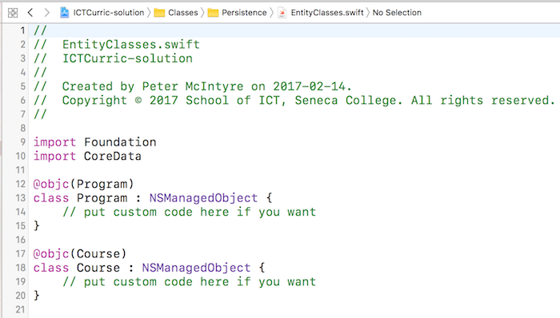
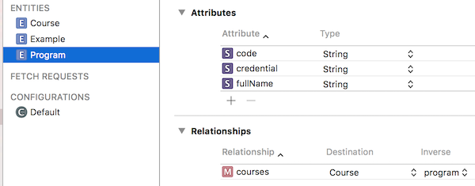

## DPS923 MAP523 Assignment 5 - School of ICT Curriculum

Assignment 5 enables you to begin working with on-device storage, using Core Data. You will create a navigation-style app, with three levels of navigation (list, list, and detail).  
 

### Due date
Wednesday, February 22, 2017, at 11:00pm ET  
Grade value: 5% of your final course grade  

*If you wish to submit the assignment before the due date and time, you can do that.*  
 

### Objective(s)
Use Core Data for on-device storage and querying.
Create an app with more than one view, as a navigation-based app, with three levels (list, list, and detail)  
Continue using the foundation topics from previous classes.  
 

### Introduction to the problem that you will solve
We need an app that will *display* information about some academic programs in the School of ICT. (Display-only, the app user will not be creating or editing information.)  

The app's start screen is a list, and will be managed by a table view controller. It will display a list of some of the academic programs in the School of ICT. 

When the app user taps/selects an item on the list, another list (managed by a table view controller) will slide in, and display a list of courses in that academic program.  

When the app user taps/selects an item on the list, a details screen (managed by a standard view controller) will slide in, and display some information about that academic program. 

> screen captures will be pasted here  

 

<kbd></kbd>  
 

### Getting started
Get (download) the CoreDataModel app, which is in the GitHub repo. (It's path is notes/Project_Templates.) 

Follow the instructions in its [Readme.txt](https://github.com/dps923/winter2017/blob/master/notes/Project_Templates/CoreDataModel/Readme.txt), to create an iOS app named **ICTCurric**.  

Show the "projects and targets list", and select the project. Verify that the iOS Deployment Target is set to version 9.0, so that the app will work with all modern/typical devices.  
 

#### Verify that the app runs  
First, run the app in the iOS Simulator, so that you know that it does successfully run. It will display a list of your professors' names, and enable you to tap/select a name to show a details view (that has a title that matches the tapped/selected professor name).  

Next, return to the iOS Simulator's home screen. Delete the app. How? Tap (click) and hold, until all the icons show an "X" badge and begin wiggling. Tap/click the "X" badge, and confirm that you want to delete the app. 

> Why must we do this?  
> Any time we make changes to the Core Data model, it invalidates any existing model and data. The easiest way to handle this now is to simply remove the app from the device (or iOS Simulator).  
> Later in the course, you will learn how to "migrate" a Core Data model to a new version, and save its data too.  

 

#### App cleanup
There will be several cleanup tasks, but we'll do them later. Why? We want to leave the "Example" code bits in the project, until we have added replacements.  
 

#### Task preview
In the sections that follow, you will perform these tasks:  
1. Design the entity classes for Program and Course, and generate custom subclasses for the entities  
2. Write code in the store initializer to create startup data for the app  
3. Create a fetched results controller for the Program collection  
4. Create a fetched results controller for the Course collection  
5. Create a controller for the Program list view  
6. Create a controller for the Course list view  
7. Create a controller for the Course detail view  
8. Update and design the storyboard scenes/views  
9. Update the code in the app delegate and new controllers  
10. Clean up the project  
 

### Design the entity classes for Program and Course  
Add a new Entity (by using the button at the bottom of the editor). The entity name will be "Program". Next, add attributes. All will be strings.  
* code  
* credential  
* fullName  

In the right-side Data Model Inspector, un-check (clear) the "Optional" checkbox for each of these attributes.  
 

Add another entity, named "Course". Next, add attributes. All will be strings.  
* code  
* courseDescription  
* fullName  

In the right-side Data Model Inspector, un-check (clear) the "Optional" checkbox for each of these attributes.  
 

#### Do the code generation tasks
Recently, you learned that it was a good idea to use *code generation* to make it easier and better to work with model objects in your apps. Here, we perform this configuration.  

For each new entity class - Program and Course - set the value of the "Codegen" setting to "Category/Extension". Remember, you do that in the Data Model Inspector.

Next, write entity classes. Here, we will use a single source code file to hold both new entity classes. To do this, create a new Swift file, named "EntityClasses.swift". Then, write the code. This is what you want to end up with:  

  
 

#### Create the relationships
For this assignment, we will assume a one-to-many relationship:  
* A Program object has a collection of zero or more Course objects  
* A Course object is always related to exactly one Program object  

Start by selecting the Course object in the editor.  Add a relationship:  
* The *name* of the relationship will be *singular*, "program"  
* Its *destination* will be the Program entity class  

Next, select the Program object in the edtor. Add a relationship:  
* The *name* of the relationship will be *plural*, "courses"  
* The *destination* will be the Course entity class  
* Choose "program" as the *inverse* relationship  

Now, re-select the Course entity. Notice that the editor has already set the relationship's inverse value. Here's what your entity configurations should look like. First, Course:  

  
 

Then, Program:  

  
 

Let's edit the relationships in the right-side Data Model Inspector.  

First, select the Course entity, and then its "program" relationship:  
* Un-check (clear) the "Optional" checkbox (in other words, a course MUST be related to an existing program)  
* Leave other settings as-is (including the Type setting, "To One")  

Then, select the Program entity, and then its "courses" relationship:  
* Change the Type setting to "To Many"  
* Leave other settings as-is (including the Optional setting, on/marked/checked)  

At this point in time, your app should build correctly, without errors.  
 

### Write code in the store initializer to create startup data for the app 
Add code  
Best practices  
We will supply a plain-text file with program and course data  
Will also supply icons that can be used on the list  
 

### Create a fetched results controller for the Program collection  
Property, and initializer code  
Follow the Example code  
 

### Create a fetched results controller for the Course collection  
Property, and initializer code  
Follow the Example code  
 

### Create a controller for the Program list view  
Follow the ExampleList view controller  
 

### Create a controller for the Course list view  
Follow the ExampleList view controller  
It will use a fetch request  
 

### Create a controller for the Course detail view  

### Update and design the storyboard scenes/views  

### Update the code in the app delegate and new controllers  

### Clean up the project  
(partial information)  

In the project navigator, locate the Example.swift class, and delete it.  

Next, in the project navigator, locate and choose/select the *ObjectModel.xcdatamodeld* object. The data model editor will open.  

Choose/select the existing "Example" entity, and delete it.  

In the project navigator, locate the Model class. Comment out the fetched results controller (frc) declaration near line 17. Then, comment out the frc configuration statement near line 40. 

   
> (more to come)

   

### Test your work
Run the app on the iOS Simulator, using different devices (that have different screen sizes):  
1. iPhone SE or 5 (4-inch screen)  
2. iPhone 7 (4.7-inch screen)  
3. iPhone 7 Plus (5.5-inch screen)  

Make sure that the content lays out nicely, in portrait mode, on all of these screen sizes.  
 

#### Borrowing a device
If you have an iOS device, great, please use it in this course. 

If you do not have an iOS device, the School of ICT has a limited supply of iPod touch devices available for loan. Contact Professor McIntyre to request a device.  
 

#### Show / prove that your app works
Final testing of your app must be on a device. Then, take a screenshot of **each** scene (list and detail). 

Screenshots can be taken:
- on the device itself
- using the Xcode Devices window (on the Window menu), you can use the "take screenshot" button, and it will be stored on the desktop.
- in the Simulator, File>Screenshot, it will store the file on the desktop

Submit **both** screenshots with your project. Put them in the project folder, before doing the zip task.  
 

### Submitting your work
Follow these instructions to submit your work:  
1. Make sure your project works correctly  
2. Locate your project folder in Finder  
3. Right-click the folder, and choose **Compress "(project-name)"**, which creates a zip file (make sure the zip file is fairly small, around 1MB or less)  
4. Login to Blackboard/My.Seneca, and in this course's Assignments area, look for the upload link, and submit your work there  
