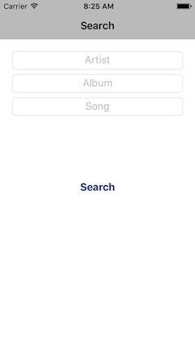
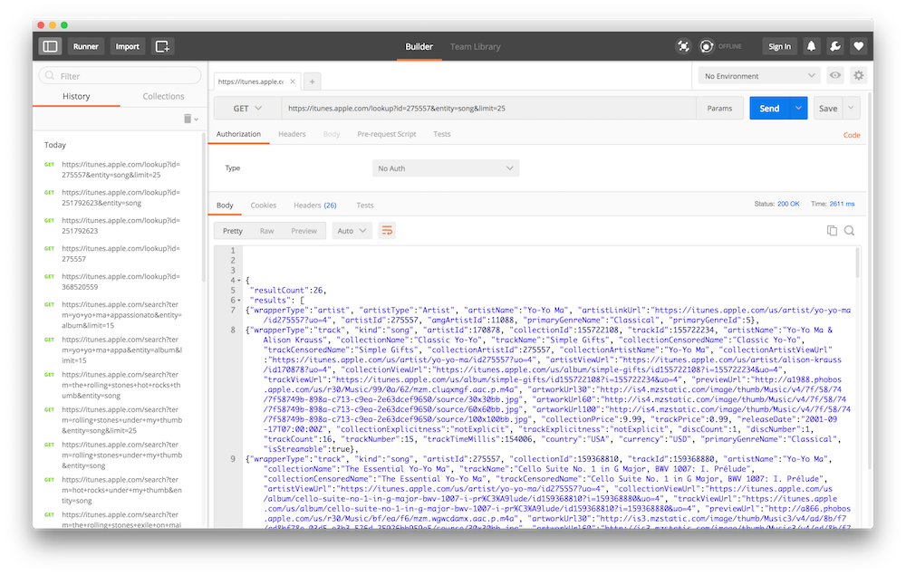
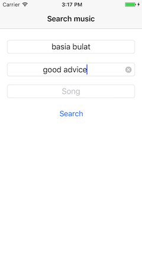
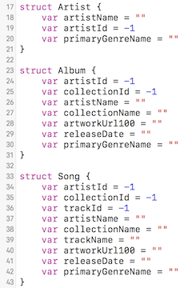

## DPS923 MAP523 Assignment 6 - Query the iTunes Store Web Service

Assignment 6 enables you to begin working with the network, in read-only mode. We will send queries to the iTunes Store web service, and display the results on the device.  
<br>

~~~
This document is being edited.  
We expect to be finished the edits by mid-day on Saturday, March 11.  
When the edits are complete, this notice will be removed.  
~~~
<br>

### Due date
Wednesday, March 15, 2017, at 11:00pm ET  
Grade value: 5% of your final course grade  

*If you wish to submit the assignment before the due date and time, you can do that.*  
<br>

### Objective(s)
Use the network, and a public web service.  
Create an interactive app with a search screen, which will lead to a navigation-based result, with two levels (list, and list-or-detail)  
Continue using the foundation topics from previous classes.  
<br>

### Introduction to the problem that you will solve
We need an app that will enable the user to search the iTunes Store for music, and *display* the results. The app uses the network, so its essential nature is that it will perform its search/fetch and rendering tasks in an asynchronous manner.  

The app's start screen is a data entry screen, and will be managed by a standard view controller. It will enable the user to enter values in one or more text fields. The purpose of this screen will be to gather search terms to be used when querying the iTunes Store web service.  

When the app user taps/selects the "Search" button, a results list (managed by a table view controller) will slide in, and display a list of items that match the search term(s).  

Then, when the app user taps/selects an item on the list, another  screen will slide in:  
* If the item is a song, a standard details view will appear  
* Alternatively, if the item is an album, a list will appear (managed by a standard view controller)  
<br>

> Notice - We plan to post a few more screen shots by mid-day Friday, March 10 (and then we'll remove this notice)  

<br>

<kbd></kbd>&nbsp;&nbsp;<kbd></kbd>&nbsp;&nbsp;<kbd></kbd>  
<br>

### Getting started
Get (download) the WebServiceModel app, which is in the GitHub repo. (Its path is notes/Project_Templates.) 

Follow the instructions in its [Readme.txt](https://github.com/dps923/winter2017/blob/master/notes/Project_Templates/WebServiceModel/Readme.txt), to create an iOS app named **MusicFinder**.  

Show the "projects and targets list", and select the project. Verify that the iOS Deployment Target is set to version 9.0, so that the app will work with all modern/typical devices.  
<br>

#### Verify that the app runs  
First, run the app in the iOS Simulator, so that you know that it does successfully run. It will display a list of academic programs offered by the School of ICT, because that's what the project template does, by default. We will replace that functionality with our own.  
<br>

#### App cleanup
There will be several cleanup tasks, but we'll do them later. Why? We want to leave the project template code bits in the project, until we have added replacements. That way, your app can be built incrementally, and it will still run successfully.  

The project includes a Core Data stack. We will not be using it in this Assignment 6. 
<br>

#### Task preview
In the sections that follow, you will perform these tasks:  
1. Visualize the storyboard  
2. Add new view controllers  
1. (to be determined)  
2. (to be determined)  
<br>

### Visualize and then partially configure the storyboard  
The storyboard in the project template enables the app to run successfully, but it will not be suitable for our use. In this section, you will learn how to modify the storyboard.    
<br>

#### Clean up the existing storyboard
The existing storyboard, as provided in the project template, has three assets on it:  
1. Navigation controller object  
2. Table view scene  
3. Standard view scene  

We do not need numbers 2 and 3. So, delete them, leaving only the navigation controller.  
<br>

#### Do an initial configuration of the storyboard
After you complete this section, your storyboard will look similar to the following:  

  
<br>

As described above, the app's start screen is a data entry screen. So, add a view controller. Position it to the right of the navigation controller.  

> We will configure its custom class (controller) later/soon.  

Add three text fields to the top area of the scene. 

> We will configure some properties of the text fields, and outlets, later/soon.  

Add a button to the view, located below the text fields. Configure its visible text to be "Search".  

> We will configure an outlet for it later/soon.  

Next, click/select the navigation controller. Add a segue to the new view controller; it will be a Relationship Segue > root view controller.  

As described above, when the app user taps/selects the "Search" button, a results list will slide in. So, add a table view controller to the storyboard. Position it to the right of the just-added view "search" controller. 

> We will configure its custom class (controller) later/soon.  
> We will also configure its prototype cell later/soon.  

Next, click/select the button on the "search" view controller. Add a segue to the new table view controller; it will be an Action Segue > Show.  

> Yes, we can do this. A button tap can trigger a segue. It does not have to be tied to an action.  

Later, we will return to the storyboard, and configure additional scenes.  
<br>

### Create a controller for the "search" scene  
In this section, you will create a *new* view controller, which will display a list of Program objects. The contents and layout of the new controller will be similar to the ExampleList controller that's included in the project template.  

There are a number of programming tasks that must be done:  
1. Create the new controller class  
2. Configure it for initialize/load, and for use with the model class  
3. Configure it in the app delegate and the storyboard  
<br>

#### Create the new controller class  
In/under the Classes group, create a new Cocoa Touch Class. It will be a subclass of UIViewController (right?). We suggest that you name it "MediaSearch".  
<br>

#### Configure it for use  
Next, study the ExampleList controller code. Notice that it has a reference to the model class. Do the same for the MediaSearch controller.  

In viewDidLoad(), set/configure the scene's title property with something (like "Search music").  
<br>

#### Fix the app delegate startup method  
In the application(didFinishLaunchingWithOptions) function, it has code that passes the model object reference to the ExampleList controller.  

Change the code so that it passes the reference to the MediaSearch controller.  
<br>

#### Fix the storyboard  
Now that we have the MediaSearch controller created and partially configured, fix the "search" scene on the storyboard. Set its custom class to MediaSearch.  
<br>

#### Test your work
At this point in time, the app should load, and show the "search" scene. It will not have any functionality yet, but it should load.  
<br>

### Learn how to use the iTunes Store web service
The iTunes Search API (web service) enables you to search for content within the iTUnes Store, App Store, iBooks Store, and Mac App Store.  

[Here is a link](https://affiliate.itunes.apple.com/resources/documentation/itunes-store-web-service-search-api/) to its documentation. The text below will get you started, but you will need to read/scan the documentation to get full value out of the API.  

As you learned in the Week 8 Monday notes and class, it is an open web service, and does not require a developer key for casual use. Specifying a resource URL that begins with  
```
https://itunes.apple.com/search?parameterkeyvalues  
```
will return plain-text JSON results.  
<br>

#### Searching for music
We want to enable the user to search for music. We will enable them to enter search terms, for at least one, but maybe any of:  
* Artist  
* Album  
* Song  

There are seven (7) kinds of queries that are possible:  
* Any one search term (3 possible)  
* Any two search term (3 possible)  
* All three search terms

For example:  

**Any one**

Artist - yes  
Album - no  
Song - no  
All works by the artist   
https://itunes.apple.com/search?term=the+rolling+stones&limit=15  

> The "limit" key is not required. It is used here to simply make the result set smaller.  

Artist - no  
Album - no  
Song - yes  
A specific song (from any artist on any album)  
https://itunes.apple.com/search?term=under+my+thumb&entity=song  

**Any two**

Artist - yes  
Album - yes  
Song - no  
A specific album by the artist  
https://itunes.apple.com/search?term=the+rolling+stones+exile+on+main&entity=album&limit=15  

Artist - no  
Album - yes  
Song - yes  
A specific song on a specific album  
https://itunes.apple.com/search?term=hot+rocks+under+my+thumb&entity=song  

Artist - yes  
Album - no  
Song - yes  
A specific song by an artist  
https://itunes.apple.com/search?term=rolling+stones+under+my+thumb&entity=song&limit=25  

**All three**

Artist - yes  
Album - yes  
Song - yes  
A specific song on a specific album by the artist  
https://itunes.apple.com/search?term=the+rolling+stones+hot+rocks+thumb&entity=song  
<br>

#### Identifiers
As you would expect, all data items have identifiers. Two common identifiers that you will see include artistId and collectionId (for the album). Here's some more information:

To extract the collectionId, which is the album identifier  
"artistId":275557, "collectionId":251792623  

Info about the artist  
https://itunes.apple.com/lookup?id=275557  

Info about the album  
https://itunes.apple.com/lookup?id=251792623    

Songs on an album  
https://itunes.apple.com/lookup?id=251792623&entity=song  

Songs by an artist  
https://itunes.apple.com/lookup?id=275557&entity=song&limit=25  
<br>

#### Wrapper types
Values in the results are organized in a certain way. For example you would expect a "song" query to include just the info about that song. Alternatively, you would expect an "album" query to include a *collection* of song items.  

We will use wrapper type values to determine what scene to show after an item is tapped/selected from a list-of-results scene (table view). Here's some more information:  

wrapperType = artist  
artistId = (a number)  
artistName = ADELE  
primaryGenreName = Pop  
artistLinkUrl = (link)  

wrapperType = collection  
collectionId = (a number)  
artistName = ADELE  
collectionName = 21  
releaseDate = (a date)  
primaryGenreName = Pop  

wrapperType = track  
trackId = (a number)  
artistName = ADELE  
collectionName = 21  
trackName = Rolling in the Deep  
releaseDate = (a date)  
primaryGenreName = Pop  
<br>

#### Interacting with the web service from your computer
A browser can sometimes interact with a web service, but you should really use an HTTP inspector, which is an app that can configure and send HTTP requests, and accept the responses. Then, it enables you to inspect both, and learn about a web service.  

Your professor team recommends that you add the Postman add-in to your Google Chrome browser configuration.  

  
<br>

### Circle back to the search scene and controller
Above, you tested your work, and were able to build, load, and run the app, which showed you the search scene. It's now time to make it work properly.  

#### Storyboard tasks
Here are some suggestions:  

Each text field should span the width of the scene. Use constraints to do that. Center align. Choose an 18-point font size.  

> Hint - You can select all three text fields at once. Command+click, or lasso. Then, make the changes.  

Add "Placeholder" text to each text field. In case you don't know, the text appears in an empty field, and acts as a hint/guide to the user. It disappears when the user begins to enter text.  

Also, configure the "Clear Button" setting to appear while editing. This will make your user happier.  

Change the button font size to 18, to match the others. 

Select the segue (to the list/table view controller). Give it an Identifier (maybe something like "toMediaList").  

Next, add outlets for ALL FOUR elements (three text fields, and the button). Note that we will NOT need an "action" connection for the button, because the button will trigger the segue.  We WILL need an outlet, so that we can disable the button when the text fields are empty.  

> Why? Think about it...  

Finally, configure the delegate property for each text field, because we will be interested in handling events (text changed, etc.). Reminder (from past assignments and practice work), Control+click+drag from each text field, to the view controller icon in the dock at the top of the view controller scene.  
<br> 

#### Controller code tasks
Above, you just configured the delegate property for each of the text fields. We recommend that you add the UITextFieldDelegate protocol adoption phrase to the controller's class declaration. That will make the methods in the protocol available to Xcode code sense.  

Let's stay with the text fields for a moment. We have an important *user interaction* goal: The "search" button should be active ONLY when there's something in one or more text fields. How are we going to do that?  

Well, we must be able to do two tasks:  
1. Be able to quickly check if the text fields are empty or not  
2. Be able to quickly enable or disable the "search" button  

When? On initial load (or appearance), and whenever the contents of ANY text field changes. 

How? While the language and SDK has ways to determine this, we want to reduce or eliminate repeated code. Therefore, we'll write a few functions.  

First, write a function that will check if the text fields are empty or not. How? Yes, you could write "if" statements, but there are three text fields, and that's not syntax or algorithm design. Let's look for a different way. Here's a question: If the total character count of ALL text fields is zero, then are the text fields empty? Or not?

```swift
// declare a function that will return true or false
// add the character count of all fields
// return true or false, appropriate to your function name 
```

Uh, OK, that's pretty vague. And what's this about the function name? Well, according to the [Swift style guide](https://swift.org/documentation/api-design-guidelines/), "Uses of Boolean methods should read as assertions about the receiver" (the receiver being the thing we're looking at).  

So the advice here is to name the function with a true or false assertion, and code the function body accordingly. The function name could therefore be either one of these general forms:  

```userHasEnteredSearchText``` (or ```doesAnyTextFieldHaveContent```) which would obviously return *true* if the user has entered search text, or  

```areTextFieldsEmpty``` which would obviously return *false* if the user has entered search text.  

Is one better than the other? Your teacher team is pretty neutral on the answer to that. However, we suggest that you look at the intended use: We want to be able to quickly enable or disable the "search" button. Let's look at the properties of a UIButton. Hmmm, there is a boolean property named ```isEnabled```. If true, the button is enabled and usable. Therefore, your teacher team has a slight preference to the first form of function name (something like userHasEnteredSearchText). Why? Easy matching of "true" conditions.  

> Stay with us. We're trying to teach you something here. And prevent crashes due to coding errors due to user interaction.  

At this point, we have task #1 above done (quickly check if the text fields are empty or not). Let's do task #2 now. 

Add a statement to ```viewDidLoad()``` that sets the button's ```isEnabled``` state. That's just safe coding practice.  

Next, write another function, probably named something like ```textFieldDidChange```. It does not need any parameters, and it won't return anything. Its only purpose is to call the function you just wrote above, and use the result to set the button's ```isEnabled``` setting.  

When will this new function be called? Whenever a "text field did change". Does this happen automatically? No - we must configure this. We suggest that you configure this in ```viewDidLoad()```. Here's a typical configuration statement, assuming a placeholder name for the outlet:

```swift
ui-object-outlet-name.addTarget(self, action: #selector(textFieldDidChange), for: .editingChanged)
```

The addTarget method enables you to handle an event from a user interface control - in this case ```editingChanged``` - with an event handler, which is our new ```textFieldDidChange``` function.  

The value for the "action" parameter is essentially the name of the function that will handle the event. Its syntax is [relatively new](https://swift.org/blog/swift-2-2-new-features/):  

```swift
#selector(name-of-function)
```
<br>

#### Test your work
At this point in time, when the app loads for the first time, the button state is disabled. As soon as one of the text fields has one (or more) characters, the button state should be enabled. Make sure this is happening before you continue.  
<br>

### Add a list/table view controller to hold the search results
In/under the Classes group, create a new Cocoa Touch Class. It will be a subclass of UITableViewController (right?). We suggest that you name it "MediaList".  
<br>

#### Edit the storyboard
On the storyboard, select the table view. Set its custom class to the new controller "MediaList".  

On its prototype cell settings:  
* Set the reuse identifier value (we've been using "cell")  
* The cell style should be "Subtitle"  
* The accessory should be "Disclosure Indicator"  
<br>

#### Configure it for use  
Return to the MediaList controller code. Next, study the ExampleList controller code. Notice that it has a reference to the model class. Do the same for the MediaSearch controller. Notice also that it adopts the WebServiceModelDelegate protocol. Do that here too. (When you do, you'll need to copy in the delegate method from the ExampleList controller - do that too.)  

In viewDidLoad(), set/configure the scene's title property with something (like "Search results"). Also, set the table view property's row height to be larger than default, for example, about 60.0.  

Now... *temporarily*, we will use a string array to be the data source. (We'll un-do this later/soon.) So, add a property to hold a string array. Its contents will be filled by the MediaSearch controller's ```prepare(forSegue: sender:)``` function.  

Number of sections? 1.  

Number of rows in a section? Return the count of the temporary string array. (You'll change this later/soon.)  

Cell content?  The array element at ```indexPath.row```.  
<br>

#### Code the segue in the MediaSearch controller
We suggest that you configure the segue now, to confirm that it is working correctly. Do this BEFORE working with the network.  

The idea will be to simply gather the text that is entered in the artist, album, and song text fields, and pass them to the list/table view controller, where they will be rendered.  

```swift
override func prepare(for segue: UIStoryboardSegue, sender: Any?) {

    // Temporary array, used to test our logic, will be removed later/soon
    var searchWords = [String]()
        
    // Get the user-entered values, add to the array
    searchWords.append((artist.text?.isEmpty)! ? "(no artist)" : artist.text!)
    searchWords.append((album.text?.isEmpty)! ? "(no album)" : album.text!)
    searchWords.append((song.text?.isEmpty)! ? "(no song)" : song.text!)
        
    let vc = segue.destination as! MediaList
    vc.model = model
    vc.searchWords = searchWords
    }
```
<br>

#### Test your work
Test your work. It should look something like the following:  

<kbd></kbd>&nbsp;&nbsp;<kbd></kbd>  
<br>

### Use the network
At this point in time, the search scene is done, and works. Also, the list-of-results scene works, with temporary data.  

Now it's time to get the network involved.  

#### Add structs that describe the entities
In the WebServiceModel source code file, add new structs for Artist, Album, and Song.  

For each, add some properties. Interact with the iTunes API, and decide for yourself what properties would be useful to have and display. For example, your teacher team thinks that these may be useful:  

<kbd></kbd>  
<br>

#### Add a function to send a request to the iTunes API
Study the code in the class. You will write another function that looks similar to ```programsGet()```.  

~~~
change the base url  
add a query string  
(to be continued)  
~~~


<br><br><br><br><br><br>
(more to come)
<br><br><br><br><br><br>


### Preview of what will come
As you read above, this document is being edited. We expect to be finished the edits by mid-day on Friday, March 10. 

However, here's a preview of the tasks that you will do, if you want to explore on your own.  
* Configure the web service object to be able to search the iTunes Store API (which will require string assembly)  
* Add the ability to handle requests for images (thumbnails), asynchronously  
* Study the results of multiple queries to be prepared for changes to the list-of-results controller  
* Edit the storyboard, to add two new scenes (controllers); one will be another list/table view (for collection results, e.g. songs on an album), and the other a standard view (for one-of result details)  
* Add and code the two new controller classes  
* Iterate and test  
<br>

### Clean up the project  
Now it's time to clean up the project (more to come).  

Reminder about the recently-learned project "clean" task: If you attempted a build/compile/run right now, it is likely that there would be an error (and that error's message isn't really helpful). The reason is due to the cleanup that we just did. Therefore, we can "clean" the project of any past compilation assets, and start anew. How?  

On the Xcode Product menu, there is a Clean option (with keyboard shortcut Command+Shift+K). Choose/run it.  

Then, build/compile (Command+B). It should be successful now. 
<br>

### Test your work
Run the app on the iOS Simulator, using different devices (that have different screen sizes):  
1. iPhone SE or 5 (4-inch screen)  
2. iPhone 7 (4.7-inch screen)  
3. iPhone 7 Plus (5.5-inch screen)  

Make sure that the content lays out nicely, in portrait mode, on all of these screen sizes.  
<br>

#### Borrowing a device
If you have an iOS device, great, please use it in this course. 

If you do not have an iOS device, the School of ICT has a limited supply of iPod touch devices available for loan. Contact Professor McIntyre to request a device.  
<br>

#### Show / prove that your app works
Final testing of your app must be on a device. Then, take a screenshot of **each** scene (list, list, and detail). 

Screenshots can be taken:
- on the device itself
- using the Xcode Devices window (on the Window menu), you can use the "take screenshot" button, and it will be stored on the desktop.
- in the Simulator, File>Screenshot, it will store the file on the desktop

Submit **all three** screenshots with your project. Put them in the project folder, before doing the zip task.  
<br>

### Submitting your work
Follow these instructions to submit your work:  
1. Make sure your project works correctly  
2. Locate your project folder in Finder  
3. Right-click the folder, and choose **Compress "(project-name)"**, which creates a zip file (make sure the zip file is fairly small, around 1MB or less)  
4. Login to Blackboard/My.Seneca, and in this course's Assignments area, look for the upload link, and submit your work there  
